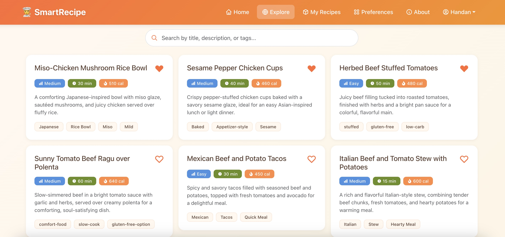

# 🧑‍🍳 SmartRecipe: AI-powered Recipe Generator

SmartRecipe is an AI-powered web application that helps users decide what to cook using the ingredients they already have. By entering a few ingredients, users can instantly generate personalized recipes, view nutritional details, and explore different cooking styles and dietary preferences.

For example, if a user inputs “tomato,” “beef,” and “potato”, AI may suggest recipes such as Beef Stew with Tomatoes or Spiced Beef and Potato Hash. The goal is to make cooking more accessible, creative, and efficient, especially for students and busy professionals who often wonder “What should I cook today?”

## ✨ Features

- **User Authentication:** User registration and login system with JWT-based authentication
- **AI Recipe Generation:** Users input their available ingredients, and AI generates three personalized recipe options displayed as interactive cards. Each card features a title, description, preparation time, difficulty level, calorie count, and relevant dietary tags
- **Recipe Details:** By clicking the recipe card, users can view complete recipe details including ingredient lists, step-by-step instructions, nutrition facts, and helpful cooking tips
- **Save Recipes:** Users can save or remove favorite recipes to their personal "My Recipes" page
- **User Preferences:** Customizable preferences for dietary restrictions (e.g., vegan, gluten-free), cuisine style (e.g., Asian, Italian), meal type, cooking complexity, and spice level. Preferences are automatically applied to recipe generation
- **Explore Community Recipes:** Browse and search through recipes saved by other users in the community

## 🛠️ Tech Stack

### Frontend

- **React** and **React Router** for frontend development and navigation
- **React Bootstrap** for responsive and accessible UI
- **Vite** for fast development and building

### Backend

- **Node.js** with **Express** for RESTful API
- **MongoDB** for data persistence
- **OpenAI API** for AI-powered recipe generation
